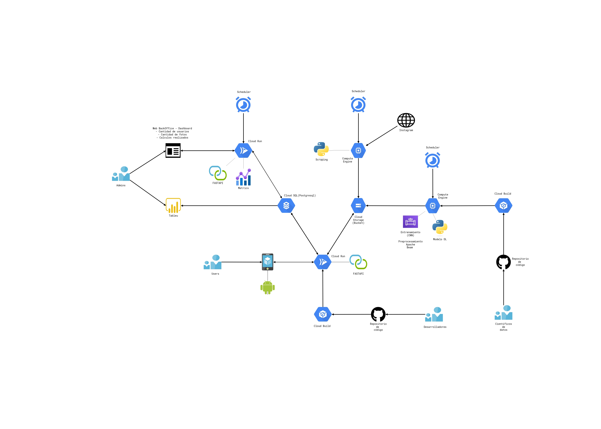

# Presentación

# Memoria

# Introducción

Se construye una aplicación móvil para, mediante el uso de algoritmos de inteligencia artificial, detectar en que imágenes existe una cara y en cuales no. 

El objetivo final es aplicarlo con una galería asociado a un evento.

Ej: Un evento cumpleaños que tiene usuarios asignados y todo el mundo pueda subir fotos y ordenar o filtrar esas fotos por la identidad de la persona.

## App

En la app se han seleccionado las siguientes herramientas, frameworks y librerías:

- Plataforma Android.
- IDE Android Studio para desarrollar
- Arquitectura MVVM para controlar el estado de las vistas
- La plataforma Firebase para la distribución de la app de pruebas
- Librería de Jetpack Compose para la creación de vistas
- Librería Hilt para realizar inyección de dependencias
- Librería Flow para el intercambio de modelos entre la arquitectura para usar reactividad
- Librería Coil para la carga asíncrona de Imágenes online
- Librería Koin como gestor de peticiones HTTP para conectar con el API Rest
- Librería de Crashlytics para capturar posibles errores en tiempo de ejecución de los clientes
- Librería de Material Design para homogeneizar el diseño de las vistas
- Librería de Compose-Navigation para gestionar rutas y navegación entre vistas
- Librería de Kotlin Serialization para la conversión de Json a objeto y viceversa.

Funcionalidades actuales de la App:

- Vista para realizar el inicio de sesión a través del Api Rest
    - Convertir los Json en clases de datos en kotlin a través del serializador de kotlin
    - Comprobación de errores
- Comprobar si existe avatar
    - Si no existe, mostramos una pantalla para que el usuario pueda seleccionar una foto y realizar la subida
    - Se comprueba en la subida que la foto contenga una cara
    - Se sube al bucket y se le asigna a su galería
    - Se navega a la pantalla de la galería del usuario
- Vista de la galería del usuario
    - Se pueden visualizar las fotos
    - Se puede visualizar el avatar del usuario
    - Se puede subir una foto
    - Se puede eliminar una foto
    - Se puede cerrar sesión

## Análisis de Dataset

Para el entrenamiento del modelo VGG16 se han utilizado dos dataset de imagenes. 

- DATASET1: **CelebFaces Attributes Dataset (CelebA). Contiene solo rostros de famosos.**
- DATASET2: **ImageNet Object Localization Challenge. Contenido diverso de objetos, vistas, paisajes,animales…etc**
- Fotos con rostro: 202.999 imagenes.
- Fotos sin rostro: 32.461 imagenes.

Se han redimensionado las imagenes para el entrenamiento del modelo en escala RGB(100x100x3) para deducir la complejidad del modelo

## La arquitectura de este modelo es la siguiente:

Se carga el modelo pre-entrenado VGG16 sin la capa superior 
(include_top=False) y se congela su pesos para que no se actualicen 
durante el entrenamiento.

Se agrega una nueva capa superior al modelo para la clasificación 
binaria. Primero se aplana la salida de la base del modelo usando la 
capa Flatten(). Luego se agrega una capa Dense de 128 unidades con 
función de activación relu, seguida de una capa de salida Dense con una 
única unidad y función de activación sigmoid.

Se compila el modelo con la función de pérdida binary_crossentropy, el optimizador Adam y la métrica de precisión (accuracy).

Finalmente, se entrena el modelo durante 15 épocas con un tamaño de 
lote (batch size) de 100 y se utiliza EarlyStopping para prevenir el 
sobreajuste. Después, se evalúa el modelo en el conjunto de pruebas.

# Re entrenamiento del modelo.

- Habilitadas las API de Cloud Build, Cloud Run y Cloud Scheduler en GCP para el proyecto.
- Creado  repositorio en GitHub con los archivos necesarios para levantar un contenedor de Docker para ejecutar una FastAPI.
- Conectado el repositorio de GitHub a Cloud Build en GCP.
- Creación de  un archivo `cloudbuild.yaml` en el repositorio que especifica cómo construir el contenedor de Docker.
- Creación de una función de Cloud Run que usa el contenedor de Docker.
- Creacion de un trabajo programado (scheduler) en Cloud Scheduler que ejecute la función de Cloud Run semanalmente.

# Arquitectura

## Arquitectura DAaas

1. Aplicación móvil. Adquisición de las imágenes a procesar. (cámara / galería de imágenes)
2. API para la aplicación móvil. Encargado de atender las peticiones de la aplicación móvil
3. BD’s para almacenar los datos del usuario.
4. Storage para el almacenamiento de las imágenes y los modelos de IA
5. Servidor para el entrenamiento del modelo IA.
6. Servidor para el scrapper
7. Repositorios para el alamacenamiento del código
8. Tareas programadas para el re-entrenamiento / scrapping / estadísticas del modelo
9. API para el cálculo de estadísticas
10. Herramienta para la visualización de estadísticas
11. Herramientas para la automatización de los cambios en el código

## Procesos

1. La aplicación móvil será la encargada de enviar las imágenes al API y mostrar los resultados del modelo
2. El API, una vez recibida la imagén  desde la aplicación móvil es el encargado de almacenar sus metadatos en la BD’s, de almacenar la imagen en el sistema de almacenamiento y enviarla al modelo para obtener el resultado. Así mismo este API será el encargado de autenticar los usuario. Residirá en un contenedor.
3. El API para el entrenamiento del modelo residirá en una máquina virtual. Se encargará de coger las imágenes para el entrenamiento desde el sistema de almacenamiento. Las imágenes para el entenamiento serán cargadas inicialmente en el sistema de forma manual  y posteriormente será alimentado de forma automática por el scrapper.
4. El scrapper residirá en otra máquina virtual que será levantada bajo demanda por un proceso programado. Se encarga de obtener imágenes de instagram y dejarlas en el sistema de almacenamiento para que sean procesadas en futuros entrenamientos del modelo.
5. Los procesos para el cálculo de estadísticas residiran en un contenedor que se lanzará de forma programada. El objetivo es tener ciertas métricas precalculadas para que la herramienta de visualización de datos pueda acceder de forma más sencilla y eficaz a la información
6. Panel de visualización de estadísticas. Se alimentará de los procesos previamente descritos y de la propia BD’s de la aplicación, así podremos visualizar datos periódicos (mesuales, semanales…) previamente calculados y datos en tiempo real (imágenes subidas…)
7. Repositorios de código. Se dispone actualmente de 3 repositorios de código: Aplicación móvil, API de la aplicación y API del modelo (train…etc)
8. Herramienta de despliegues automáticos. Dispone de 3 procesos distintos (uno por repositorio) y 3 dispadores. Se ha diseñado así para poder realizar desarrollos y despliegues independientes de cada una de las partes del sistema. 

## Desarrollo de la arquitectura

Toda la arquitectura ha sido diseñada con las diferentes herramientas que proporciona Goolge Cloud.

1. La apliacación móvil será la pieza de entrada por parte del usuario al sistema. Las funciones principales que desempeña son:
    - Identificación y registro de usuario. Mediante usuario y contraseña.
    - Obtención y envío de las imágenes del usuario. Actualmente se realiza a través de la cámara del dispositivo. Se tiene pensado acceder a la galería de imágenes.
    - Gestión de las imágenes del usuario.
    - Gestión del avatar o imágen de identificación del usuario.
    
    La aplicación móvil ha sido desarrollada para el sistema Android con el lenguaje de programación Kotlin
    
2. API de la aplicación móvil. (Cloud RUN)
    
    Ha sido desarrollado con el framework FASTAPI en el lenguaje de programación Python. Dispone de la ruta /docs en la que se podrá encontrar la interfaz gráfica Swagger como documentación. El API se encuentra desplegado como contendor Docker bajo la herramienta Cloud Run. Se ha seleccionado esta herramienta principamente por su facilidad de configuración para los despliegues automáticos y su adaptación a la carga del sistema pudiendo escalar de forma automática.
    
    Las principales funciones que realiza son:
    
    - Autenticación del usuario
    - Subida de imágenes al bucket.
    - Transformación y predicción de la imágen. Desde el modelo entrenado.
    - Almacenamiento de los metadatos de la imagen en la BD’s
    - Operaciones para la gentión de imágenes (CRUD de imágenes)
    - Operaciones para la gestión de usuarios (CRUD de usuarios)
    
    Los endpoints de los que dispone son los siguientes:
    
    - /auth: API de autenticación
        - GET /auth/me→ Obtencón de los datos del usuario sin las imagenes asociadas al mismo.
        - POST /auth/login → Login del usuario. Si es correcto recibirá el token correspondiente.
    - /users: API reacionada con los usuarios
        - GET /users → Obtencón de los datos del usuario junto con los datos de las imágenes que ha subido
        - POST /users → Creación de usuarios nuevos
        - GET /users/images → Obtención de las imágenes
        - POST /users/upload → Subir imagen del avatar
        - DELETE /users → Eliminar el avatar
    - /images: API relacionada con las imágenes
        - GET /images→ Obtencón de los datos de las imágenes del usuario
        - GET /images/<id>→ Obtención de los datos de una imagen concreta
        - GET /images/<id>/download → Descarga del fichero imagen
        - DELETE /images/<id> → ELiminar la imagen de la aplicación. Borra también del bucket
    
3. API para el entrenamiento del modelo. (Compute Engine, Cloud Scheduler)
    
    Ha sido desarrollado con el framework FASTAPI en el lenguaje de programación Python. Dispone de la ruta /docs en la que se podrá encontrar la interfaz gráfica Swagger como documentación. El API se encuentra hospedado en una máquina virtual de la herramienta Compute Engine. Se ha optado por esta herramienta debido a los elevados tiempos de proceso para el entrenamiento del modelo. El entrenamiento del modelo será lanzado con un cron programado semanalmente con la herramienta Cloud Scheduler.
    
    Las principales funciones que realiza son:
    
    - Obtención de las imágenes desde el sistema de almacenamiento.
    - Entrenamiento del modelo. Dispone de un endpoint para poder lanzarlo de forma programada desde un programador de eventos. Una vez terminado el entrenamiento desplegará el modelo en el sistema de almacenamiento para poder ser utilizado desde el contenedor del API de la aplicación
    - Una vez entrenado el modelo despliegue en el sistema de almacenamiento (.h5)
4. Scrapper (Compute Engine, Cloud Scheduler)
    
    Ha sido desarrollado con el framework FASTAPI en el lenguaje de programación Python. El scrapper se encuantra hospedado en una máquina virtual de la herramienta Compute Engine. Será lanzado con un cron programado semanalmente con la herramienta Cloud Scheduler.
    
    Las principales funciones que realiza son:
    
    - Obtención de las imágenes desde Instagram
    - Alimentar las imágenes de entrenamiento del modelo. Subiendo las imágenes etiquetadas al sistema de almacenamiento.
5. Storage (Cloud Storage)
    
    Se dispone de dos Buckets distintos:
    
    1. Almacenamiento de las imágenes de los usuarios.
    2. Almacenamiento de las imágenes para el entrenamiento del modelo. Se realizará una carga manual (upload) inicial de imágenes y posteriormente se irá alimentando con las imágenes que se obtienen mediante el scrapper.
6. BD’s (Cloud SQL)
    
    Como Bd’s se ha elegido PostgreSQL hospedada en el servicio administrado Cloud SQL. Se ha elegido esta herramienta por la facilidad de configuración y la alta disponibilidad de las misma. Internamente la BD’s estará compuesta principalmente de las siguientes tablas:
    
    1. Usuarios. Almacenamiento de los datos de los usuarios. (email, nombre, passwd…..)
    2. Imágenes. Almacenamiento de los metadatos de las imágenes (nombre, tamaño, fechas…)
    3. Estadísticas. Alamacenamiento de datos precalculados. (por periodos de tiempo, eventos….)
7. Cálculo de estadísticas (Compute Engine)
    
    Han sido desarrollados con el framework FASTAPI en el lenguaje de programación Python. Los procesos para el cálculo de estadístiscas se encuantra hospedado en una máquina virtual de la herramienta Compute Engine. Será lanzado con un cron programado semanalmente con la herramienta Cloud Scheduler.
    
    Su principal funcionalidad es la de realizar ciertos precálculos para facilitar y acelerar el procesamiento de la información con la herramienta de visualización.
    
8. Panel de visualización de estadísticas (Tableau)
    
    El panel ha sido desarrollado con Tableau con la finalidad de poder realizar un seguimiento del uso de la aplicación por parte de los usuarios:
    
    Las principales métricas que obtiene son:
    
    - Rasgos faciales: que cumpla con los patrones de rostro de la persona.
    - Estado de animo (expresiones faciales)
    - Genero
    - Número de rostros identificados
    - Raza
    - Accesorios
    - Edad
9. Respositorios de código. (Github)
    
    El código reside en Github. Se ha decidido utilizar esta herramienta por que es casi un estandard en el desarrollo de aplicaciones y su capacidad de integración con Google Cloud. 
    
    Los repositorios que se han creado son los siguientes:
    
    - Api de la aplicación
    - Aplicación móvil
    - Entrenamiento del modelo.
    
10. Despliegues automáticos (Cloud Build)
    
    Se han creado los respectivos scripts de despliegue automático para la herramienta Cloud Build en cada uno de los repositorios, de forma que cada vez que se realice una actualización del código en la rama principal del repositorio se despliegue de forma automática.
    

## Esquema de la arquitectura

## Modelo

Visualización (Tableau):

- Gran parte de los Dashboards que se encuentran para el tema del reconocimiento facial estan relacionados con:
    - Los resultados que se obtienen en cuanto:
        - presición del algoritmo y margen de error.
        - expresión facial (estado de animo)
        - edad
        - zonas o paises donde hacen más uso de la aplicación del reconocimiento facial
        - Aplicaciones más comunes del reconocimiento facial
        - Accesorios
        - Raza (origen étnico)
        - Genero
        
        ## Fases del proyecto:
        
        1. Registro de cliente en la App
        2. Inicio de sesión del cliente en la App.
            1. Autenticación del usuario
        3. Captura:
            1. El usuario debe de tener sincronizada su galeria con la App
            2. Realizar una fotografia o captura del rostro a identificar
            3. Comprobar que la nueva fotografia no es contenido explicito (filtro de fotografia que cumple con las normas y restricciones)
        4. Reconocimiento facial:
            1. Ejecución del modelo de reconocimiento facial
            2. Proceso de comparación entre fotos de galeria y captura: identificación de objeto principal y las demás imagenes donde más aparece.
        5. Resultados:
            1. Mostrar en App todas las imagenes donde hay reconocimiento e identificación del objeto principal.
        6. Mejoras futuras:
            1. Gestionar imagenes: Si aparece sonriendo, serio, con más personas (clasificar y/o etiquetar imagenes), eliminar duplicados, mostrar por ubicación, etc.
            2. Añadir una modelo de negocio Freemium y Premium por las nuevas funcionalidades para que los usuarios puedas gestionar sus imagenes y optimización su almacenamiento.
